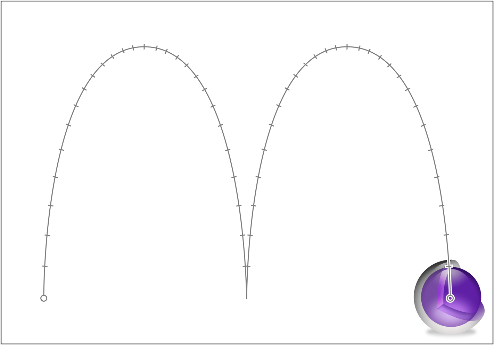

# 动画基础

- [简单动画](#Animating Simple Changes to a Layer’s Properties)
- [关键帧动画](#Using a Keyframe Animation to Change Layer Properties)
	- [关键帧](#Specifying Keyframe Values)
	- [时间设置](#Specifying the Timing of a Keyframe Animation)
- [停止动画](#Stopping an Explicit Animation While It Is Running)
- [组合多个动画](#Animating Multiple Changes Together)
- [监听动画状态](#Detecting the End of an Animation)

<a name="Animating Simple Changes to a Layer’s Properties"></a>
## 简单动画

如下代码演示了一个非常简单的淡出动画：

```swift
let animation = CABasicAnimation(keyPath: "opacity")
animation.duration = 2.0
animation.fromValue = 1.0
animation.toValue = 0.0
layer.addAnimation(animation, forKey: nil)
```

需要注意的是，与直接修改图层属性自动触发的隐式动画不同，设置显示动画的属性并不会影响图层的属性，默认情况下，动画结束后就会被自动移除，此时图层会恢复到动画开始前的状态。若想维持动画结束后的状态，基本上有三种方案：

- 添加动画后直接更新图层相应属性，此时必须设置动画对象的 `fromValue` 属性。
- 动画结束后再更新图层相应属性，可以利用 `animationDidStop(_:finished:)` 代理方法，或者利用 `CATransaction` 的类方法 `setCompletionBlock(_:)` 设置一个完成闭包。
- 关闭动画对象的 `removedOnCompletion` 属性，并将 `fillMode` 属性设置为 `kCAFillModeForwards`。

最后一种方案的缺点是浪费性能，默认情况下，动画结束后就会被移除，而该方案不会移除动画，这将导致额外的性能开销。第二种方案的缺点则是麻烦。一般来说，最常用的解决方案是第一种，但是在设置图层属性的时候，如果图层是独立的图层，也就是说不是视图关联的图层，为了避免触发图层的隐式动画，应该像下面这样在关闭隐式动画的情况下更新图层属性：

```swift
CATransaction.begin()
CATransaction.setDisableActions(true)
layer.opacity = 0.0
CATransaction.commit()
```

<a name="Using a Keyframe Animation to Change Layer Properties"></a>
## 关键帧动画

如下代码演示了一个以贝塞尔曲线为动画路径的关键帧动画：

```swift
let path = CGPathCreateMutable()
CGPathMoveToPoint(path, nil, 74.0, 74.0);
CGPathAddCurveToPoint(path, nil, 74.0, 500.0, 320.0, 500.0, 320.0, 74.0);
CGPathAddCurveToPoint(path, nil, 320.0, 500.0, 566.0, 500.0, 566.0, 74.0);

let animation = CAKeyframeAnimation(keyPath: "position")
animation.path = path
animation.duration = 5.0

layer.addAnimation(animation, forKey: nil)
```

其运动路径如下图所示：



<a name="Specifying Keyframe Values"></a>
### 关键帧

关键帧是关键帧动画的核心，可以通过动画对象的 `values` 指定包含一系列关键帧的值的数组，或者像上面示例代码一样通过 `path` 属性指定一个动画路径。`path` 属性的类型是固定的 `CGPath`，`values` 数组中的值是 `AnyObject` 类型，可以视为 Objective-C 中的 `id` 类型，这些值的具体类型要取决于具体情况。例如，若想对图层的 `contents` 做动画，数组中的值就应该是 `CGImage` 对象，即 `contents` 属性的类型；若想对图层的 `borderColor` 做动画，数组中的值就应该是 `CGColor` 对象，即 `borderColor` 属性的类型；若想对图层的 `bounds`、`transform` 这种结构体类型的属性做动画，则需使用 `NSValue` 对结构体进行包装；若想对图层的 `opacity` 这种类型为标量的属性做动画，直接将相应标量值放入数组中即可。在 Swift 中还是相当方便的，C 结构体不用转换为 `id` 类型，标量也不用包装成 `NSNumber` 了，不过部分结构体类型还是得用 `NSValue` 包装一下才能兼容 `AnyObject` 类型。

<a name="Specifying the Timing of a Keyframe Animation"></a>
### 时间设置

- `calculationMode` 属性指定了计算动画速率的算法：
	- 指定 `kCAAnimationLinear` 或 `kCAAnimationCubic` 将会根据指定的时间函数来计算动画时间，可以对动画速率进行比较全面的控制。
	- 指定 `kCAAnimationPaced` 或 `kCAAnimationCubicPaced` 将会忽略 `keyTimes` 和 `timingFunctions` 属性，动画会保持匀速。
	- 指定 `kCAAnimationDiscrete` 实现不连续的动画，直接由一帧跳至另一帧。`timingFunctions` 会被忽略，但是 `keyTimes` 依然有效。
- `keyTimes` 属性指定了关键帧对应的时刻，例如，指定总时间的三分之一时应该对应哪一关键帧。该属性仅在 `kCAAnimationLinear`、`kCAAnimationCubic` 和 `kCAAnimationDiscrete` 三种模式下有效。
- `timingFunctions` 指定了关键帧之间的时间曲线，例如指定第一帧和第二帧之间的速率为先快后慢，第二帧和第三帧之间的速率为匀速等等。该属性将替代继承而来的 `timingFunction` 属性。

总之，若想自己控制动画速率，指定 `kCAAnimationLinear` 或 `kCAAnimationCubic` 模式，并通过 `keyTimes` 和 `timingFunctions` 属性进行控制。`keyTimes` 控制关键帧呈现的时间点，`timingFunctions` 则控制关键帧之间的速率。

<a name="Stopping an Explicit Animation While It Is Running"></a>
## 停止动画

动画执行完毕就会自动停止，但是在动画过程中也可以手动停止动画，只需将动画对象从图层上移除即可，有两种方式：

- 利用图层对象的 `removeAnimationForKey(_:)` 方法根据添加动画时指定的键移除单个动画。
- 利用图层对象的 `removeAllAnimations()` 方法移除图层上添加的所有动画。

只有显示动画才可以移除，隐式动画无法移除。

需要注意的是，移除动画后，核心动画会根据图层的当前状态重新渲染，这意味着图层不会保持在动画移除瞬间的状态。若希望图层保持在移除瞬间的状态，可以先通过图层的 `presentationLayer()` 方法获取到呈现树中的对应图层，获取图层的实时状态并设置给图层，然后再移除动画。对于上面的动画例子来说，应该这样移除动画：

```swift
layer.position = layer.presentationLayer()!.position
layer.removeAllAnimations()
```

<a name="Animating Multiple Changes Together"></a>
## 组合多个动画

通过 `CAAnimationGroup`，可以方便地组合多个动画，进行统一配置。`CAAnimationGroup` 会覆盖单个动画对象中和时间、速率有关的属性设置。下面代码演示了如何使用 `CAAnimationGroup` 来组合多个动画：

```swift
let animation1 = CAKeyframeAnimation(keyPath: "borderWidth")
animation1.values = [ 1.0, 10.0, 5.0, 30.0, 0.5, 15.0, 2.0, 50.0, 0.0 ]
animation1.calculationMode = kCAAnimationPaced

let animation2 = CAKeyframeAnimation(keyPath: "borderColor")
animation2.values = [ UIColor.greenColor().CGColor,
					  UIColor.redColor().CGColor, 
					  UIColor.blueColor().CGColor ]
animation2.calculationMode = kCAAnimationPaced

let group = CAAnimationGroup()
group.animations = [ animation1, animation2 ]
group.duration = 5.0

layer.addAnimation(group, forKey: nil)
```

如前所述，`values` 数组中的值应和图层相应属性的类型相同，而将 `calculationMode` 设置为 `kCAAnimationPaced` 则可以获得匀速的动画。

<a name="Detecting the End of an Animation"></a>
## 监听动画状态

核心动画支持监听动画的开始和结束，可以通过两种不同的方式：

- 使用 `CATransaction` 的类方法 `setCompletionBlock(_:)` 设置一个完成闭包，该闭包在动画完成或者被移除时调用，缺点是无法得知动画是否是正常结束的。
- 成为动画对象的代理，实现代理方法 `animationDidStart(_:)` 和 `animationDidStop(_:finished:)`，从而在动画开始前和结束后得到通知，此种方式虽然麻烦，但是可以判断出动画是正常结束还是被中途移除。

如果需要连接两个动画，即在前一个动画结束时紧接着执行另一个动画，可以不依赖动画完成的回调方法，而是使用后一个动画对象的 `beginTime` 属性来设置开始时间。假如有两个独立的动画，希望后一个动画在前一个动画结束后才开始，就可以像下面这样：

```swift
let animation1 = /* ... */
animation1.duration = 3.0

let animation2 = /* ... */
animation2.duration = 2.0
// 获取当前时间，再加上 animation1 的持续时间，以此作为 animation2 的开始时间
animation2.beginTime = CACurrentMediaTime() + animation1.duration 
```

但如果使用了 `CAAnimationGroup`，则 `beginTime` 不要加上 `CACurrentMediaTime()`，如下所示：

```swift
let animation1 = /* ... */
animation1.duration = 3.0

let animation2 = /* ... */
animation2.duration = 2.0
animation2.beginTime = animation1.duration // 直接以 animation1 的持续时间作为 animation2 的开始时间即可

let group = CAAnimationGroup()
group.duration = 5.0
group.animations = [ animation1, animation2 ]
```

两个动画同为动画组中的成员，动画总时间持续 `5s`，前 `3s` 执行第一个动画，后 `2s` 执行第二个动画，注意 `beginTime` 没有加上 `CACurrentMediaTime()`。
