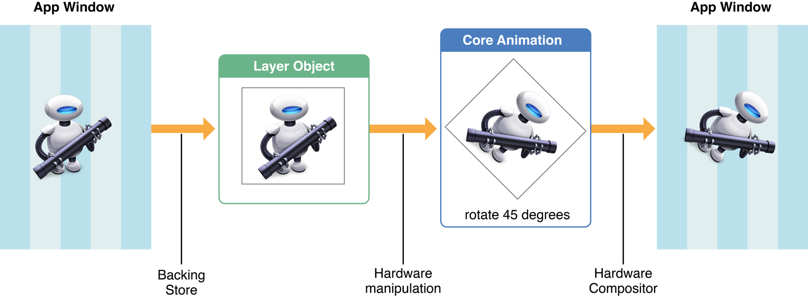
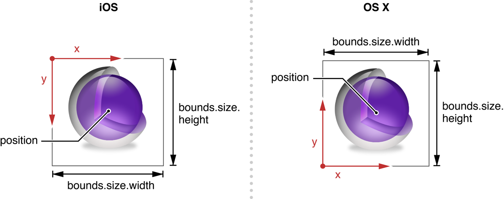
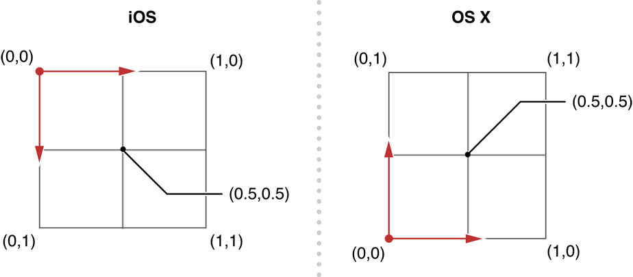
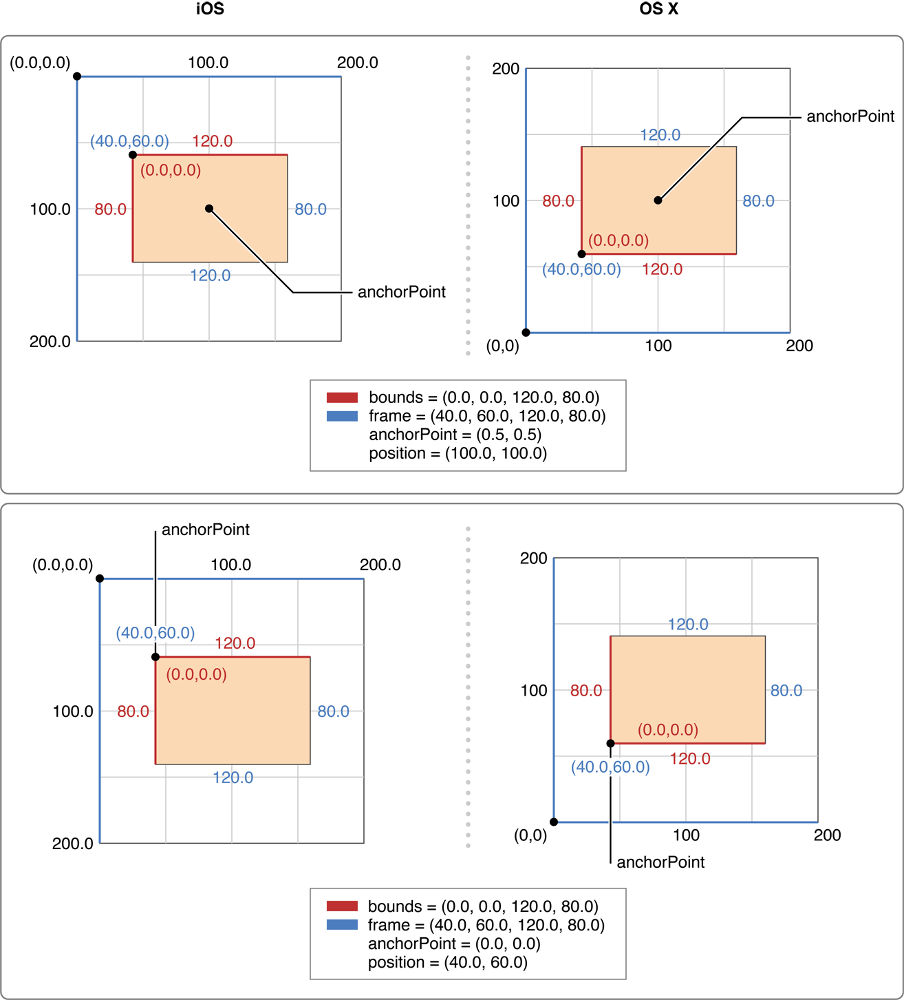
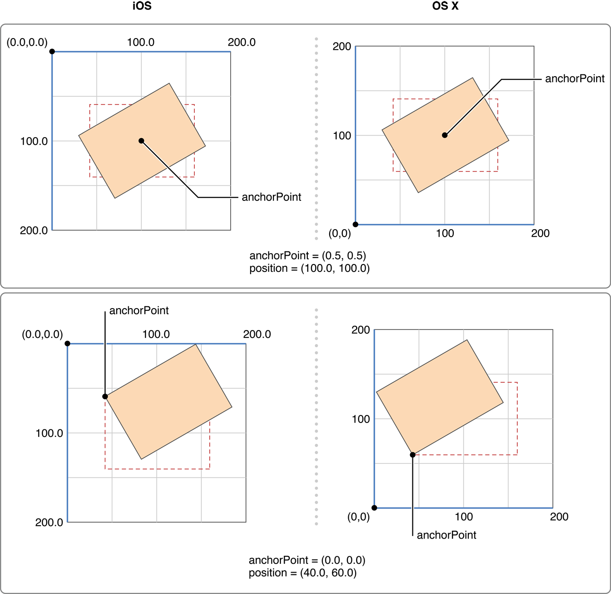
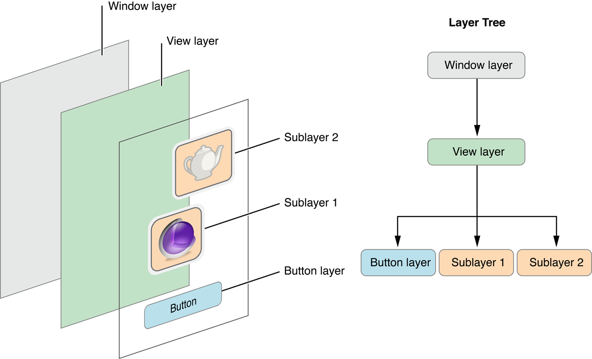
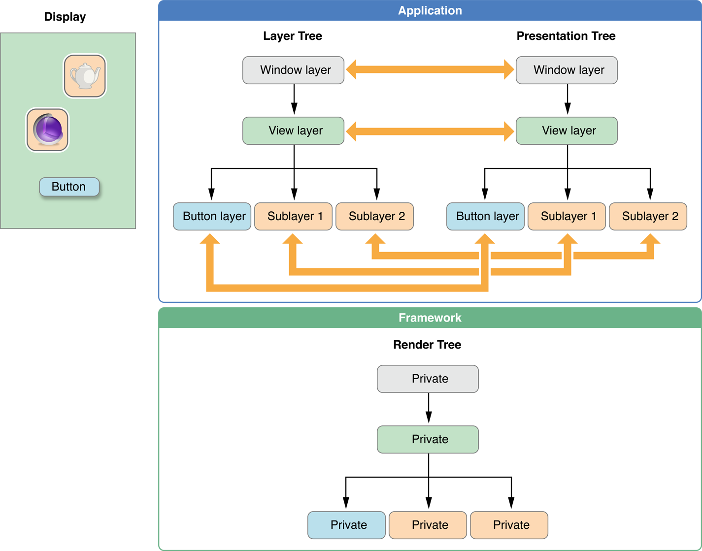

# 核心动画基本概念

- [图层为绘制和动画提供基础](#Layers Provide the Basis for Drawing and Animations)
- [图层几何结构](#Layer Objects Define Their Own Geometry)
- [图层树](#Layer Trees Reflect Different Aspects of the Animation State)

## 图层为绘制和动画提供基础

图层是核心动画的核心所在，管理着一些关于几何结构、显示内容、视觉属性之类的信息，它是一个管理数据的模型对象。图层并不负责绘制，它只是捕获应用程序的当前内容到一张位图中，一般称之为“后备存储”。改变图层属性以及执行动画时，相关信息和位图会提交给 `GPU` 进行硬件层面的渲染，这比利用 `CPU` 进行软渲染（例如利用 `Core Graphic` 框架进行绘制）要高效许多。

## 图层几何结构

图层使用两种坐标系统，一种是基于点的坐标系统，另一种是单位坐标系统。基于点的坐标系统用于描述图层和屏幕或者其他图层之间的位置关系，诸如 `position`、`bounds`、`frame` 这类属性都是使用该坐标系统。单位坐标系统用于描述相对于图层宽度或高度的比例，取值范围总是 `[0,1]`，诸如 `anchorPoint`、`contentsRect`、`contentsCenter` 这类属性都是使用该坐标系统。

`bounds` 属性相对于图层自身的坐标系，因此原点默认为 `{0.0,0.0}`，它还定义了图层的尺寸。`position` 属性则定义了图层在父坐标系中的位置。而 `frame` 属性类似于计算型属性，是结合 `position` 和 `bounds` 这两个属性得出的值，而修改 `frame` 也会影响这两个属性。

另外，`iOS` 和 `OS X` 的坐标系的 Y 轴是相反的，如下图所示：

可以利用图层的 `geometryFlipped` 属性将图层的坐标系统沿 Y 轴翻转，这将影响图层自身以及子图层，但不会影响图层的 `contents` 的渲染。

`anchorPoint` 属性会影响图层的 `position` 以及旋转。换言之，`position` 可以理解为 `anchorPoint` 在父坐标系中的位置，而图层旋转时会以 `anchorPoint` 为中心。默认情况下，`anchorPoint` 为 `{0.5,0.5}`，也就是图层正中心，如下图所示：

如下图所示，将 `anchorPoint` 由默认值改为 `{0.0,0.0}` 后，若要保证图层在父坐标系中位置不变，即 `frame` 不变，则 `position` 必须发生改变：

其实在实际操作中，修改 `anchorPoint` 不会改变 `position`，只会改变 `frame`，也就是说，图层在父坐标系中的位置会变化。对于上图来说，图层的左上角会跑到坐标系中心去，如前所述，`position` 可以理解为 `anchorPoint` 在父坐标系中的位置，现在图层的左上角才是 `anchorPoint`。在实际操作中，修改 `anchorPoint` 后若想保持位置不变，重新设置一下 `frame` 即可，这将导致 `position` 发生变化。

下图则演示了 `anchorPoint` 变化对图层旋转造成的影响，可以看到，图层始终以 `anchorPoint` 为中心进行旋转：
 

下面两图展示了图层的 `transform` 属性和矩阵之间的对应关系：

另外，`sublayerTransform` 属性可以统一设置应用于所有子图层的变换矩阵信息，常用于设置子图层的透视变换效果。

## 图层树

核心动画拥有三种树型结构，分别是模型树、呈现树和渲染树：

- 模型树中的图层和界面层级相互对应，也是最常使用的图层，但它们无法提供图层在动画过程中的实时状态。
- 呈现树中的图层和模型树中的图层相互对应，它们可以提供图层在动画过程中的实时状态。
- 渲染树中的对象是负责实际渲染的私有对象，由核心动画控制。

下图展示了界面层级和模型树的对应关系：

下图展示了三种树的对应关系：

可以看到，模型树和呈现树相互对应，通过模型树中的图层的 `presentationLayer()` 方法可以获取呈现树中对应的图层，从而可以在动画过程中获取图层的实时状态。相应的，对于呈现树中的图层，通过 `modelLayer()` 方法可以获取模型树中对应的图层。
