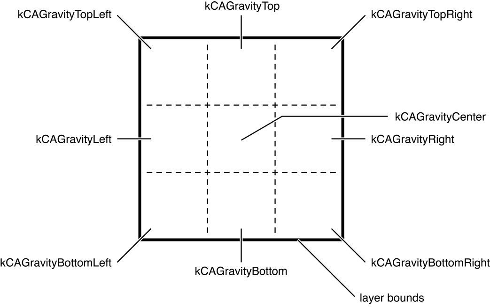
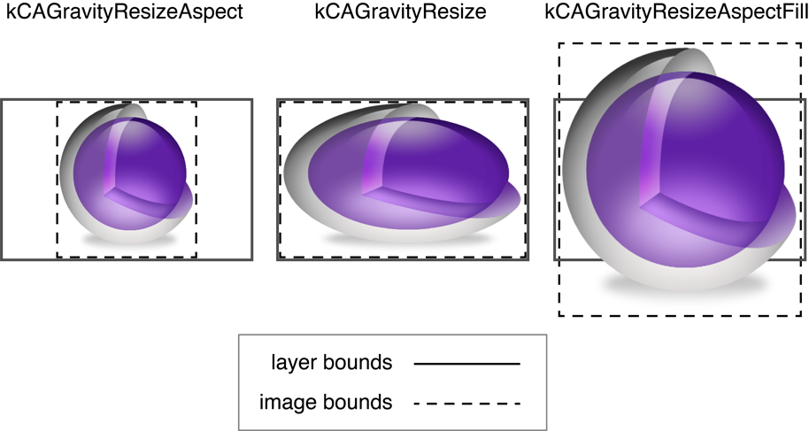
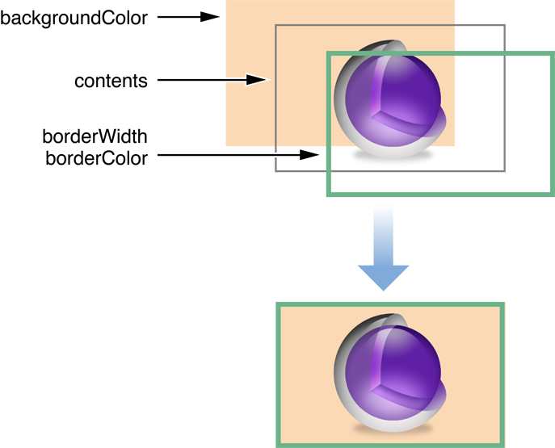
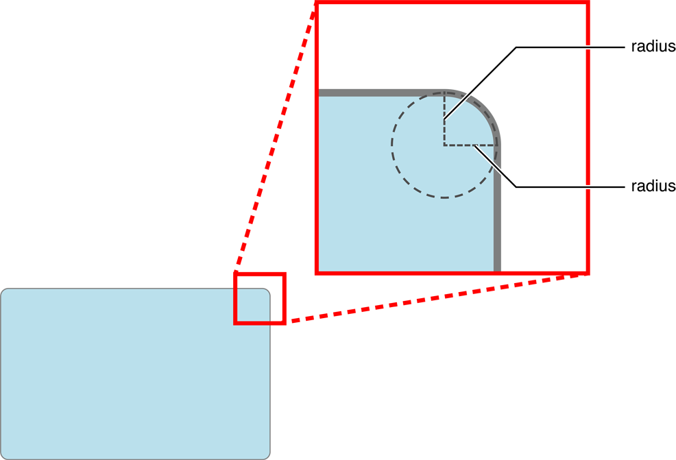
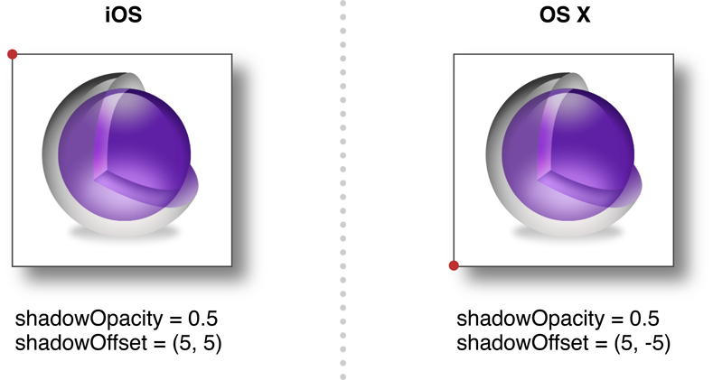

# 设置图层

- [更改视图关联的图层类型](#Changing the Layer Object Associated with a View)
- [为图层提供显示内容](#Providing a Layer’s Contents)
	- [使用图片提供图层内容](#Using an Image for the Layer’s Content)
	- [使用代理提供图层内容](#Using a Delegate to Provide the Layer’s Content)
	- [使用子类提供图层内容](#Providing Layer Content Through Subclassing)
	- [调整内容模式](#Tweaking the Content You Provide)
	- [处理高分辨率图片](#Working with High-Resolution Images)
- [调整图层的视觉风格和外观](#Adjusting a Layer’s Visual Style and Appearance)
	- [背景色和边框](#Layers Have Their Own Background and Border)
	- [圆角](#Layers Support a Corner Radius)
	- [阴影](#Layers Support Built-In Shadows)
- [添加自定义属性到图层](#Adding Custom Properties to a Layer)

<a name="Changing the Layer Object Associated with a View"></a>
## 更改视图关联的图层类型

默认情况下，`UIView` 关联的图层是最基本的 `CALayer`，为了实现特殊功能，可以更改关联的图层。只需重写如下方法，返回对应的图层类型即可：

```swift
class MyView: UIView {
    override class func layerClass() -> AnyClass {
        return CAShapeLayer.self // 现在 MyView 的 layer 属性就是一个 CAShapeLayer 而不是默认的 CALayer 了
    }
}
```

除了最基本的 `CALayer`，还有很多具有特殊功能的图层子类，例如，可实现粒子效果的 `CAEmitterLayer`，可实现线性梯度渐变效果的 `CAGradientLayer`，能够复制子图层从而实现大量重复动画的 `CAReplicatorLayer`，可呈现各种形状的 `CAShapeLayer`，专门用来绘制文本的 `CATextLayer`，用于将大图分成小块载入来提高性能的 `CATiledLayer`，以及能呈现立体效果的 `CATransformLayer` 等等。

<a name="Providing a Layer’s Contents"></a>
## 为图层提供显示内容

图层只是个模型类，管理着需要显示的内容以及各项设置参数。图层显示的内容就是一张图片，和 `CALayer` 的 `contents` 属性相关联。可以通过三种方式来为图层提供显示的图片：

- 直接将一个 `CGImageRef` 对象赋值给 `contents` 属性。主要适合于图层内容基本不变的情况。
- 成为图层的代理，提供或者绘制位图。例如，`UIView` 就是其关联图层的代理，注意不要破坏这种关系。
- 成为图层子类，重写相关方法来提供或者绘制位图。想创建自定义图层时可以考虑此方案。

只有在单独使用图层的时候才需要为图层提供内容，如上所述，使用 `UIView` 时，它是其图层的代理，会负责提供适当的显示内容。另外，有时候根本不需要图层显示什么内容，这时需要的可能只是图层的背景色和形状、圆角之类的外观。

<a name="Using an Image for the Layer’s Content"></a>
### 使用图片提供图层内容

直接将一个 `CGImageRef` 对象赋值给 `contents` 属性即可，该方式最为直接，而且性能可观。使用此种方式时，图层不会额外开辟后备存储，而且同一图片设置给多个图层时，它们会共享图片，缩减内存开销。需要注意的是，设置高分辨率图片时，有时需要调整图层的 `contentsScale` 属性为相应值，才能正确地显示图片。详情参阅【[处理高分辨率图片](#Working with High-Resolution Images)】。

<a name="Using a Delegate to Provide the Layer’s Content"></a>
### 使用代理提供图层内容

如果图层显示的内容会动态变化，使用代理来动态提供内容是不错的选择。在显示内容时，图层会调用相应的代理方法：

- 若代理实现了 `displayLayer(_:)` 方法，则代理应在此方法中为传入的图层对象的 `contents` 属性赋值。
- 若代理未实现上述方法，但实现了 `drawLayer(_:inContext:)` 方法，图层会额外开辟后备存储，并创建一个位图上下文传入此方法，代理应在此方法中将内容绘制到该位图上下文中。

代理只需实现两个方法中的一个即可，前者的优先级要高于后者。下面代码粗略展示了这两种方法：

```swift
override func displayLayer(layer: CALayer) {
	layer.contents = UIImage(named: "anImage")?.CGImage
}
```

```swift
override func drawLayer(layer: CALayer, inContext ctx: CGContext) {
    UIGraphicsPushContext(ctx)
    UIImage(named: "anImage")?.drawInRect(CGContextGetClipBoundingBox(ctx))
    UIGraphicsPopContext()
}
```

在使用 `UIView` 时，想要自定义绘制内容时，应该使用 `UIView` 的 `drawRect(_:)` 方法，而不是重写上面的代理方法。在 `UIView` 的实现中，`drawRect(_:)` 方法的定位估计类似如下这样：

```swift
class UIView: UIResponder {
    override func drawLayer(layer: CALayer, inContext ctx: CGContext) {
        UIGraphicsPushContext(ctx)
        drawRect(CGContextGetClipBoundingBox(ctx))
        UIGraphicsPopContext()
    }
}
```

<a name="Providing Layer Content Through Subclassing"></a>
### 使用子类提供图层内容

通过子类化，可以完全自定义一个图层，此时应该重写如下两个方法之一来提供图层内容：

- 重写 `display()` 方法，在方法内直接设置图层的 `contents` 属性。
- 重写 `drawInContext(_:)` 方法，在方法内将显示内容绘制到传入的位图上下文中。

可以看到，图层代理和子类化两种方式非常相似。实际上，`display()` 方法正是这一系列方式的入口，该方法的默认实现会尝试调用 `displayLayer(_:)` 代理方法，若代理未实现，则额外开辟后备存储，创建位图上下文，并调用 `drawInContext(_:)` 方法。而 `drawInContext(_:)` 方法的默认实现则会尝试调用 `drawLayer(_:inContext:)` 代理方法。

需要注意的是，图层不会自动更新内容，除非直接设置 `contents`。相比之下，`UIView` 如果实现了`drawRect(_:)` 方法，视图被添加到视图层级上就会自动调用该方法。而图层需手动调用 `setNeedsDisplay()` 方法，图层才会调用相应方法尝试在下个运行循环更新内容。与之对应，也可以调用 `displayIfNeeded()` 方法强制立即更新图层内容。另外，调用这两个方法更新图层内容会清除 `contents`，为新内容开路，因此直接设置 `contents` 时不要调用它们，否则内容会被清除。

<a name="Tweaking the Content You Provide"></a>
### 调整内容模式

为图层设置 `contents` 时，`contentsGravity` 属性将决定图片如何适应图层，类似于 `UIView` 的 `contentMode` 属性。默认情况下，该属性为 `kCAGravityResize`，图片会完全充满图层，这可能会造成图片扭曲。`contentsGravity` 属性可以分为两类：

- 基于位置。图片不会被缩放，只会位于图层某边边界、某个顶角或者居中。如果图片过大，可能会被裁剪；如果图片过小，图层的背景色就会露出来。
- 基于缩放。图片居中，按比例或者不按比例来缩放，以填充或适应图层。

下面的图片分别展示了这两类效果：




<a name="Working with High-Resolution Images"></a>
### 处理高分辨率图片

当为图层的 `contents` 设置了高分辨率的图片时，且 `contentsGravity` 的模式不是缩放类模式时，需要设置图层的 `contentsScale` 属性，图片才能正确显示。例如，默认情况下，该值为 `1.0`，如果此时为图层设置了 `@2x` 的图片，且 `contentsGravity` 为 `kCAGravityCenter`，即居中模式，图片就会显得非常巨大。因此，此时应该将 `contentsScale` 设置为 `2.0`，对应图片的分辨率，从而正确显示。如果通过绘制位图来提供图片，或者 `contentsGravity` 的模式是缩放类的模式，则不存在此问题。

<a name="Adjusting a Layer’s Visual Style and Appearance"></a>
## 调整图层的视觉风格和外观

图层自带一些视觉效果，例如圆角、边框、阴影之类，只需设置几个属性，相应的渲染会自行完成，包括动画效果。

<a name="Layers Have Their Own Background and Border"></a>
### 背景色和边框

图层可以设置背景色以及边框，背景色由 `backgroundColor` 属性决定，边框由 `borderWidth`和 `borderColor` 属性决定。背景色位于图层的内容图片下方，边框则位于内容图片以及所有子图层的上方。因此，内容图片中透明的部分会露出背景色，如下图所示：



> 注意  
如果图层的背景是不透明的，并且没有圆角，可将图层的 `opaque` 属性设置为 `true`。这样图层需要额外开辟后备存储时就可以忽略透明通道，还可免去额外的颜色混合操作，从而增强渲染性能。

<a name="Layers Support a Corner Radius"></a>
### 圆角

图层还可以设置圆角，由 `cornerRadius` 属性决定，影响图层四个顶角。需要注意的是，圆角默认只会裁剪图层背景色与边框，而图层的 `contents`，也就是内容图片不会被裁剪，除非开启 `masksToBounds` 属性。



<a name="Layers Support Built-In Shadows"></a>
### 阴影

图层还可以设置阴影，从而呈现出浮在背后的内容之上的效果。阴影效果比较复杂，和很多属性有关，如下所示：

```swift
/* 阴影颜色，默认为不透明黑色。支持动画。*/
var shadowColor: CGColor?

/* 阴影透明度，默认为 0，即不可见。取值范围 [0,1]。支持动画。*/
var shadowOpacity: Float
    
/* 阴影偏移量，默认为 (0, -3)。支持动画。*/
var shadowOffset: CGSize
    
/* 阴影模糊度，默认为 3。支持动画。*/
var shadowRadius: CGFloat
    
/* 阴影路径，默认为 nil。若指定，则直接以路径为轮廓来构建阴影，而不是根据图层的透明通道来计算，可以增强性能。支持动画。*/
var shadowPath: CGPath?
```

另外，`iOS` 和 `OS X` 的阴影坐标系是上下颠倒的，区别如下图所示：



还需要注意的是，阴影是图层内容的一部分，只不过它超出了图层自身的范围。这意味着如果开启 `masksToBounds` 属性，外围阴影就会被裁剪掉。如果图层还含有透明部分，就能透过去看到图层下方的阴影还在，但是外围阴影却被完全裁剪掉的奇怪效果。解决方案是额外使用一个与原图层重合的图层来构建阴影，这样就不受原图层裁剪的影响了。

<a name="Adding Custom Properties to a Layer"></a>
## 添加自定义属性到图层

`CAAnimation` 和 `CALayer` 支持自定义的键值编码，可以使用自定义的键来关联一个属性上去。例如：

```swift
// 图层并没有 someKey 这个属性，但是可以将 someObject 这个值关联到图层上
layer.setValue(someObject, forKey: "someKey")
// 之后就可以通过同样的键获取关联的值
layer.valueForKey("someKey")
```

除此之外，还可以为自定义属性关联动作，从而在改变这些属性的时候也能获得动画效果。详情参阅【[改变图层的默认行为](../Changing-a-Layer%E2%80%99s-Default-Behavior/Changing-a-Layer%E2%80%99s-Default-Behavior.md)】。
